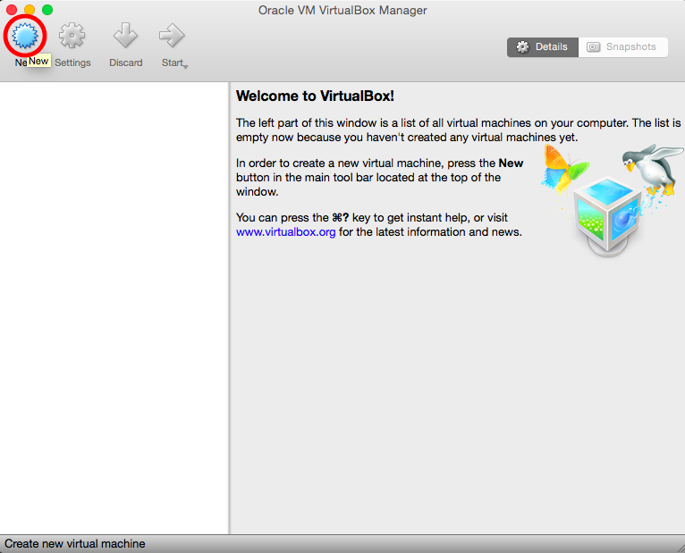

Title: Setting up the LITMUS-RT VM
CSS:    ../inc/format.css

{{../inc/header2.markdown}}

## Step-by-Step VM Setup Instructions for Virtual Box

First, download and install the latest version of VirtualBox:

- [https://www.virtualbox.org/wiki/Downloads](https://www.virtualbox.org/wiki/Downloads)

(Note: we recommend using the pre-built binaries.)

Second, download and unpack the LITMUS^RT Xubuntu Image for VirtualBox (3.0 GiB):

- [http://www.litmus-rt.org/tutor16/litmus-2016.1.qcow.gz](http://www.litmus-rt.org/tutor16/litmus-2016.1.qcow.gz)

Third, create a new guest VM based on the downloaded image.  The following steps describe how to create a new guest in VirtualBox using the provided image.

1) Create a new VirtualBox image by clicking the "New" button.

---

2) Select "Ubuntu (64-bit)" as the distro and hit "Continue."

---

3) Ensure that the machine has sufficient RAM. We recommend 2GB for following along with the tutorial.

---

4) Select "Use an existing virtual hard disk file" and click the button to choose a disk image.

---

5) Navigate to and select the LITMUS^RT QCOW image and hit "Open."

---

6) Now simply click "Create" and the virtual machine should be created.

---

7) Before booting up, click "Settings > System > Processor" and ensure that 2 processors are selected and that PAE/NX is disabled.

---

8) Booting the VM should bring up GRUB. The first option (Ubuntu) boots by default into LITMUS^RT.

{{../inc/footer.markdown}}
